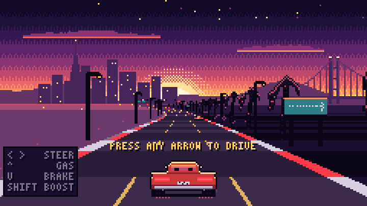

# Sunset Highway

A tiny pixel-art drive into the sunset, in one HTML file with no assets, libraries or network requests.

**Play:** https://nnixaa.github.io/sunset-highway/

- Leave it alone and the car cruises on its own while lo-fi music plays.
- Press an arrow (or touch the screen) to take the wheel: the engine starts, the music picks up, and coins and a score appear.
- `← →` steer · `↑` gas · `↓` brake · `Shift` boost · `M` sound

Everything is drawn procedurally on a 240×135 canvas, and the music and engine are synthesized with the Web Audio API.
